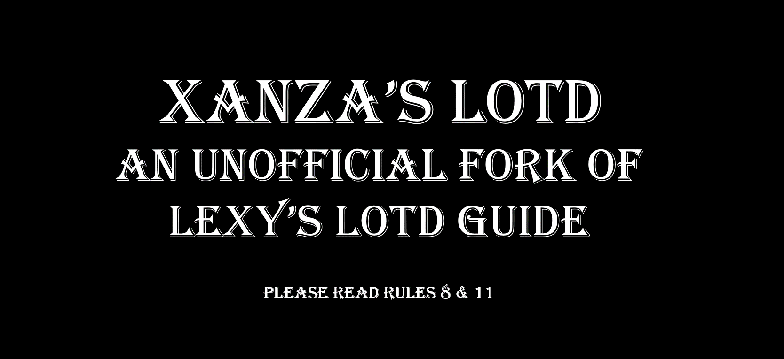

# Xanza's LOTD

- [Xanza's LOTD](#xanzas-lotd)
- [Preamble](#preamble)
- [Installation](#installation)
  - [Pre-Installation](#pre-installation)
    - [Installing Microsoft Visual C++ Redistributable Package](#installing-microsoft-visual-c-redistributable-package)
    - [Steam Config](#steam-config)
      - [Disable the Steam Overlay](#disable-the-steam-overlay)
    - [Change Steams Update Behavior](#change-steams-update-behavior)
    - [Set the Game language to English](#set-the-game-language-to-english)
    - [Clean Skyrim](#clean-skyrim)
    - [Start Skyrim](#start-skyrim)
  - [Using Wabbajack](#using-wabbajack)
    - [Preparations](#preparations)
    - [Downloading and Installing](#downloading-and-installing)
      - [Problems with Wabbajack](#problems-with-wabbajack)
  - [Post-Installation](#post-installation)
    - [Copy Game Folder Files](#copy-game-folder-files)
- [Updating](#updating)
- [Additional Mods](#additional-mods)
  - [Wintersun](#wintersun)
  - [AllGUD](#all-geared-up-derivative-allgud)
  - [Artesian Cloaks of Skyrim](#hdt-cloaks)
  - [Vampire Facial Reclamation](#vampire-face)
  - [Skyrim Reputation](#skyrim-reputation)
  - [Animation Mods](#animation-mods)
- [In-Game MCM Options](#in-game-mcm-options)
  - [Follower Framework](#follower-framework)
- [Creating your Character](#creating-your-character)
- [FAQ](#faq)
- [Tweaking Performance](#tweaking-performance)
  - [Tweaking the ENB](#tweaking-the-enb)
  - [Tweaking the Game Settings](#tweaking-the-game-settings)
- [Removing the Modlist](#removing-the-modlist)
- [Credits and Thanks](#credits-and-thanks)
- [Contact](#contact)
- [Contributing](#contributing)
- [Changelog](#changelog)

# Preamble

This is a fork of Lexy's Legacy of the Dragonborn list with a few choice additions such as Wintersun and Skyrim Reputation. Under no circumstances should you be bothering her or her team with issues for this list.

## Installation

### Pre-Installation

These steps are only needed if you install this Modlist for the first time. If you update the Modlist, jump straight to [Updating](#updating).

#### Installing Microsoft Visual C++ Redistributable Package

I doubt you need to do this since you likely already have this installed. The package is required for MO2 and you can download it from [Microsoft](https://support.microsoft.com/en-us/help/2977003/the-latest-supported-visual-c-downloads). Download the x64 version under "Visual Studio 2015, 2017 and 2019". [Direct link](https://aka.ms/vs/16/release/vc_redist.x64.exe) if you can't find it.

#### Steam Config

##### Disable the Steam Overlay

The Steam Overlay can cause issues with ENB and is recommended to be turned off.

Open the Properties window (right click the game in your Library->Properties), navigate to the _General_ tab and un-tick the _Enable the Steam Overlay while in-game_ checkbox.

#### Change Steams Update Behavior

SSE is still being updated by Bethesda (they only add Creation Club content). Whenever the game updates, the entire modding community goes silent for the next one or two weeks because some mods need to be updated to the latest game runtime version.

To ensure that Steam does not automatically updates the game for you, head over to the Properties window, navigate to the _Updates_ tab and change _Automatic updates_ to _Only update this game when I launch it_. You should also disable the Steam Cloud while you're at it.

#### Set the Game language to English

Just do it. This entire Modlist is in English and 99% of all mods you will find are also in English. I highly recommend playing the game in English and **I will not give support to people with a non-English game**.

Open the Steam Properties window, navigate to the _Language_ tab and select _English_ from the dropdown menu.

#### Clean Skyrim

I highly recommend uninstalling the game through Steam, deleting the game folder and reinstalling it. You should also clean up the `Skyrim Special Edition` folder in `Documents/My Games/`.

#### Start Skyrim

After you have done everything above and got a clean SSE installation ready, start the Launcher and open the _Options_ menu.

1. Click on _High_
2. Set the _Aspect Ratio_ and _Resolution_ to your monitor's native values
3. Set _Antialiasing_ to _Off_
4. Check _Windowed Mode_ and _Borderless_

Start the game and exit once you're in the main menu.

### Using Wabbajack

#### Preparations

Let's get to the actual installation. Grab the latest release of Elder Souls from [the release tab](https://github.com/jdsmith2816/eldersouls/releases).

Download the release to a _working folder_. This folder **must not** be in a _common folders_ like your Desktop, Downloads or Program Files folder. It's best to create a Wabbajack folder near the root level of your drive like `C:/Wabbajack`.

Grab the latest release of Wabbajack from [here](https://github.com/wabbajack-tools/wabbajack/releases) and place the `Wabbajack.exe` file in the _working folder_.

#### Downloading and Installing

The download and installation process can take a very long time depending on your system specs. Wabbajack will calculate the amount of threads it will use at the start of the installation. To have the highest amount of threads and thus the fastest speed, it is advised to have the working folder on an SSD.

1. Open Wabbajack
2. Load the Modlist from Disk
3. Adjust the download and installation paths
4. Click the Go/Begin button
5. Wait for Wabbajack to finish

##### Problems with Wabbajack

There are a lot of different scenarios where Wabbajack will produce an error. I recommend re-running Wabbajack before posting anything. Wabbajack will continue where it left off so you loose no progress.

**Could not download x**:

If a mod updated and the old files got deleted, it is impossible to download them. In this case just wait till I update the Modlist.

**x is not a whitelisted download**:

This can happen when I update the modlist. Check if a new update is available and wait if there is none.

**Wabbajack could not find my game folder**:

Wabbajack will not work with a pirated version of the game. If you own the game on Steam, go back to the [Pre-Installation](#pre-installation) step.

### Post-Installation

#### Copy Game Folder Files

Download the latest ENB Series from [here](http://enbdev.com/download_mod_tesskyrimse.htm) and copy `d3d11.dll` and `d3dcompiler_46e.dll` to your game folder.

Copy the all of the files from the `MO2/Game Folder Files` directory into your game folder.

#### Setting up NVIDIA Profile Inspector (NVIDIA GPUs Only)

Navigate to Xanza's LOTD/tools/NVIDIA Profile Inspector. Load up nvidiaProfileInspector.exe and use the search bar and navigate to The Elder Scrolls V: Skyrim Special Edition. In the new window, in the toolbar at the top is an icon of a box with a green arrow pointing downwards. Click on this button, then "Import Profiles" in the drop-down that appears.

In the window that appears, navigate to and select Skyrim SE Nvidia Inspector Profile.nip. The profile is now installed and you can close the program.

## Updating

If this Modlist receives an update please check the Changelog before doing anything. Always backup your saves or start a new game after updating.

**Wabbajack will delete all files that are not part of the Modlist when updating!**

This means that any additional mods you have installed on top of the Modlist will be deleted. Your downloads folder will not be touched!

Updating is like installing. You only have to make sure that you select the same path and tick the _overwrite existing Modlist_ button.

## Additional Mods
These are additional mods I have added over the regular Lexy's install.

### Wintersun

Wintersun adds religion and worship. Praying, worship at shrines and adhering to the tenets of your deity strengthens your bond with the deity and eventually grants divine powers. In addition to the divines and daedric princes, the mod adds many other deities from Elder Scrolls lore, each with their own shrines in the world.

[More information can be found here](https://www.nexusmods.com/skyrimspecialedition/mods/22506)

### All Geared Up Derivative (ALLGUD)

AllGUD is a mod that shows all your visible favorited gear as well as offer dual sheathe meshes. 

[More information can be found here](https://www.nexusmods.com/skyrimspecialedition/mods/28833)

### Artesian Cloaks of Skyrim

Artesian Cloaks of Skyrim adds HDT Physics to Cloaks of Skyrim and Winter is Coming. These new cloak meshes are also compatible with kryptopyr's Complete Crafting Overhaul Remastered.

[More information can be found here](https://www.nexusmods.com/skyrimspecialedition/mods/17416)

### Vampire Facial Reclamation

To Reclaim your Pretty Human Face from the Ravages of Vampirism. No Sunken anything for Male or Female player as vampire.

[More information can be found here](https://www.nexusmods.com/skyrimspecialedition/mods/13030?tab=files)

### Skyrim Reputation

Skyrim Reputation introduces a reputation mechanic to make you treated as the hero or villain you really are, without it interfering with your game-play. All functions of the mod can be toggled on/off in the MCM menu.

[More information can be found here](https://www.nexusmods.com/skyrimspecialedition/mods/22374)

### Animation Mods

Currently the list comes with 3 additional animation mods

[Project New Reign - Nemesis PCEA](https://www.nexusmods.com/skyrimspecialedition/mods/31667) - A complete revamped version of all other PCEA made from scratch. Nemesis PCEA's new design eliminates many bugs haunting other PCEA as well as greatly improves the performance. The day of Alternate Animation mods messing with your PCEA is over. 10 slots is not enough? Fear not, Nemesis PCEA supports up to 20 slots

[Pretty Combat Animations](https://www.nexusmods.com/skyrimspecialedition/mods/3761) - This mod has provide many of new weapon idle animations, and they are full set (including walk/run/turn). You can choose different style to replace the vanilla, Just try it and I wish you like it.

[Magic Casting Animation Overhaul](https://www.nexusmods.com/skyrimspecialedition/mods/5215) - This Mod will Replace vanilla skyrim staff and unarmed magic casting animations with animations that are a lot less jank and look cool.

## In-Game MCM Options

Everything not listed below is already configured for you. Feel free to peruse the settings and change them as you like.

### Follower Framework

- System
  - Load from File
  - Hotkeyed Abilities
    - Customize as you wish

## Creating your Character

Simply step up to the statue of mara and choose a start.

## FAQ

- My character is stuck dodging

  - This happens occasionally on load but rarely in gameplay. Press 'G' to fix it.

- I'm a 21:9 resolution user and my screen looks weird
  - Search 21x9 in mod organizer and activate all of those mods. Do this before creating your character or you'll need to do alot of configuration to get the UI looking right!!

## Tweaking Performance

My Setup:

- Ryzen 1700 running at 3GHz
- 1080ti
- 32GB DDR4-3200 RAM (CL 14)
- Game and MO2 running on a Samsung 850 EVO SSD

### Tweaking the ENB

This should always be the first thing you tweak. Disabling the ENB entirely can give you anything from 20 to >70 FPS. The ENB this Modlist comes with (see [ENB: Ominous](#enb-ominous)) is rather performance intensive. Open the ENB GUI using `Right Shift + Enter` (`Right Shift` is under the `Enter` key). This will open up the ENB GUI where you can enable and disable certain effects in the left panel.

- `Bloom`: Can give you up to 3 FPS, will make light sources less bright
- `DepthOfField`: Can give you up to 10 FPS, disabled by default and not really suited for gameplay
- `Ambient Occlusion`: This one is a big hitter. You can get up to 20 FPS by disabling this but the effect is very noticeable
- `Distant/DetailedShadow`: Those two can really give you a lot of FPS back depending on your shader settings (game settings). They are very noticeable.
- `ComplexFire/ParticleLights`: You won't see a lot of difference at first when disabling those two, but when particles are on screen (eg using magic or near light sources such as fires), they can _burn_ through your FPS

### Tweaking the Game Settings

I highly recommend using [BethINI](https://www.nexusmods.com/skyrimspecialedition/mods/4875) which is included in this Modlist (can be found in `MO2/tools/BethINI`). I recommend tweaking the `Detail` section for more FPS:

- `Shadow Resolution`: Very big one. A good balance is `2048` which is the borderline between high FPS drainage and garbage looking shadows.
- `Ambient Occlusion`: Highly recommended to leave this at `None`. The ENB this Modlist comes with, uses the ENB SAO which is 10x better and performance friendly than base game SAO.
- `Detailed Draw Distance`: Maybe try `2000` instead of `2800` but you won't notice a lot of FPS gain (maybe 1-3)
- `Remove Shadows`: If you really struggle, use this. This will disable all Shadows (not recommended)

## Removing the Modlist

You can just remove the MO2 folder and be done with it. SKSE and ENB files will still be in your game folder so I recommend using [ENB and ReShade Manager](https://www.nexusmods.com/skyrimspecialedition/mods/4143) if you want to remove the ENB.

## Credits and Thanks

- _YOU_ for actually reading the readme. Thanks a ton!!
- The Phoenix Flavor by Phoenix - General ideas and awesomesauce derived therefrom
- Lotus by erri120 - Repository template and NPC visuals
- Total - Being a really helpful guy.
- Halgari and everyone the WJ Team - Wabbajack is awesome and so are you
- KentuckyFriedCrusade - Thanks for the great work on the main menu and dark mode ui!!

## Contact

While I'm always available on the [Wabbajack Discord](https://discord.gg/wabbajack), I would advise checking the [Issues](https://github.com/jdsmith2816/eldersouls/issues) (open **and** closed ones) on GitHub first if you have any problems. The same goes for _Enhancements_ or _Feature/Mod Requests_. **DO NOT DM ME ON DISCORD. I WILL NOT PROVIDE SUPPORT FOR YOU IN DMS AND I WILL BLOCK YOU**.

## Contributing

See [Contributing](CONTRIBUTING.md).

## Changelog

See [Changelog](CHANGELOG.md).
